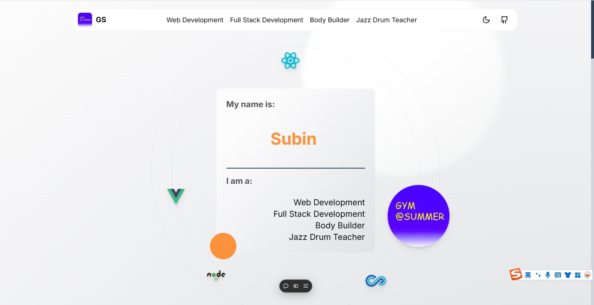

# Shadcn Website Build with the Next.js 14

## Overview

通过以下库快速搭建nextjs个人网站

- Framework: Next.js 14
- Styling: Tailwind CSS
- Headless UI: shadcn-ui、radix-ui、magic-ui、aceternity-ui
- Database: Postgres
- ORM: sequelize

## Todo

- [x] 响应式
- [x] 滑动导航
- [x] 暗黑模式
- [x] 日历卡片、支持PG数据库录入
- [ ] 多种主题色
- [ ] 可配置更换素材
